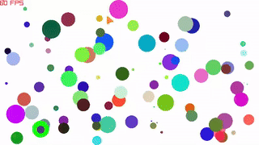

# Bouncing Ball

> Bouncing game written in C, used raylib library. Funny with multiple balls.
> There are multiple balls but there is no balls has the same. Maybe it does
> because I used `rand()` to get the random number.

